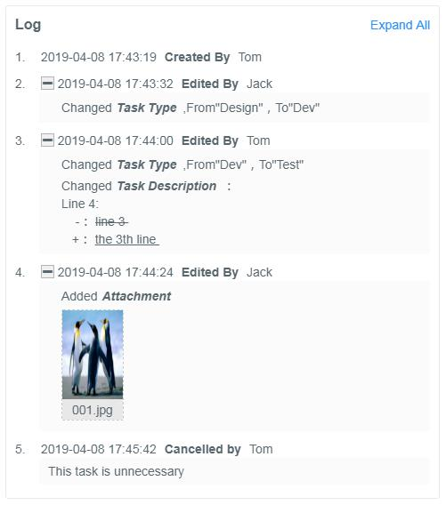
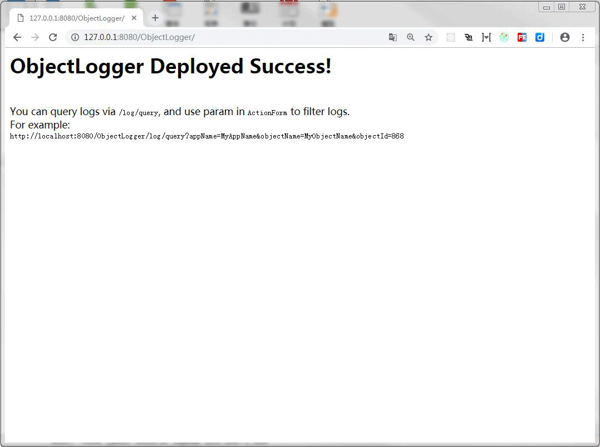
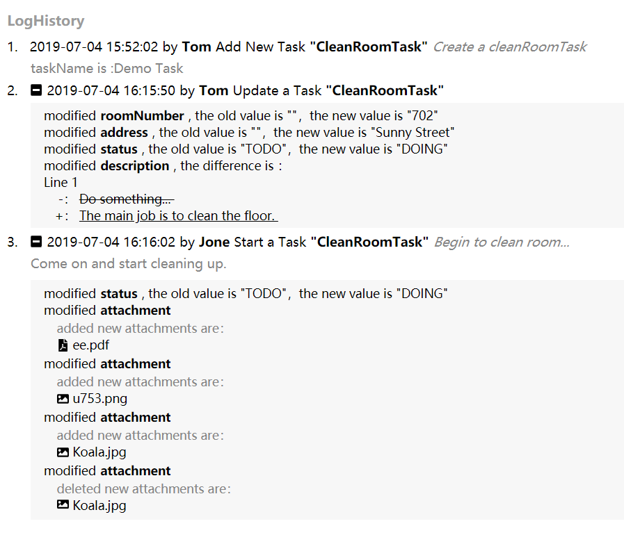

<div align="left">

</div>

# [ObjectLogger](https://github.com/yeecode/ObjectLogger)


[](https://codebeat.co/projects/github-com-yeecode-objectlogger-master)


The powerful and easy-to-use object log system, supports writing and querying of object attribute changes.

---

[中文说明](./README_CN.md)

---

# 1 Introduction

ObjectLogger is powerful and easy-to-use object log system, which supports writing and querying of object attribute changes.

It can be used in many scenarios, such as user operation log record, object attribute change record and so on.



The system has the following characteristics:

- It supports logging and query, and developers only need to redevelop the web page before using.
- It is not coupled with business systems.Pluggable use, without affecting the main business process.
- It can be used by multiple business systems at the same time without affecting each other.
- It can be started directly using the jar package; the business system is supported by the official Maven plug-in.
- It can automatically parse the attribute changes of objects and support the comparison of rich text.
- It supports extension of more object attribute types.

# 2 Quick Start

## 2.1 Create Data Tables

Use `/server/database/init_data_table.sql` to init two data tables.

## 2.2 Start Server

Download the new target jar file from `/server/target/ObjectLogger-*.jar`. 

Start the jar with the following statement:

```
java -jar ObjectLogger-*.jar --spring.datasource.driver-class-name={db_driver} --spring.datasource.url=jdbc:{db}://{db_address}/{db_name} --spring.datasource.username={db_username} --spring.datasource.password={db_password}
```

The above configuration items are described below:

- `db_driver`:Database driver. `com.mysql.jdbc.Driver` for MySQL database; `com.microsoft.sqlserver.jdbc.SQLServerDriver` for SqlServer database. 
- `db`:DataBase type. `mysql`  for MySQL database ;`sqlserver`  for SqlServer database. 
- `db_address`:Database address. If the database is native, `127.0.0.1`. 
- `db_name`:Database name.. 
- `db_username`:User name used to log in to the database.
- `db_password`:Password used to log in to the database.

After starting the jar package, the default welcome page is:

```
http://127.0.0.1:8080/ObjectLogger/
```

Visit the above address to see the following welcome interface:


The ObjectLogger system has been built.

# 3 Access Service System

This section explains how to configure the business system to record object changes in the business system into ObjectLogger.

## 3.1 Add Dependency

Add dependency package in POM file：

```
<dependency>
    <groupId>com.github.yeecode.objectLogger</groupId>
    <artifactId>ObjectLoggerClient</artifactId>
    <version>{last_version}</version>
</dependency>
```

## 3.2 Scan Beans in ObjectLoggerClient

### 3.2.1 SpringBoot

Add `@ComponentScan` and add ``com.github.yeecode.objectLoggerClient` in `basePackages`：

```
@SpringBootApplication
@ComponentScan(basePackages={"{your_beans_root}","com.github.yeecode.objectLogger"})
public class MyBootAppApplication {
public static void main(String[] args) {
    // Eliminate other code
  }
}
```
### 3.2.2 Spring

Add the following code to `applicationContext.xml` file:

```
<context:component-scan base-package="com.github.yeecode.objectLoggerClient">
</context:component-scan>
```

## 3.3 Configuration

Add the following code to `application.properties`:

```
yeecode.objectLogger.serverAddress=http://{ObjectLogger_address}
yeecode.objectLogger.businessAppName={your_app_name}
yeecode.objectLogger.autoLogAttributes=true
```

- `ObjectLogger_address`: The deployment address of the ObjectLogger in the previous step, such as: `127.0.0.1:8080`
- `your_app_name`:The application name of the current business system. In order to differentiate log sources and support multiple business systems at the same time
- `yeecode.objectLogger.autoLogAttributes`:Whether to automatically record all attributes of an object

At this point, the configuration of the business system is completed.

# 4 Query Logs


The logs recorded in the system can be queried by `ObjectLogger/log/query', and the logs can be filtered by passing in parameters.



# 5 Show Logs


[react-object-logger](https://github.com/promise-coding/react-object-logger) is the react plugin for ObjectLogger project to show logs in web:



More information can be obtained via [react-object-logger](https://github.com/promise-coding/react-object-logger).

Plugins for other Front-end technology stacks are also under development.

# 6 Insert Logs

The business system introduces `LogClient` in any class that requires logging:

```
@Autowired
private LogClient logClient;
```

## 6.1 Simple Use

Just put the zero, one or more attributes of the object into `List<BaseAttributeModel>` and call `logAttributes` method. For example, a business application calls:

```
logClient.logAttributes(
                "CleanRoomTask",
                5,
                "Tom",
                "add",
                "Add New Task",
                "Create a cleanRoomTask",
                "taskName is :Demo Task",
                null);
```

Query form ObjectLogger：
```
http://{your_ObjectLogger_address}/ObjectLogger/log/query?appName=ObjectLoggerDemo&objectName=CleanRoomTask&objectId=5
```

Results：
```
{
  "respMsg": "SUCCESS",
  "respData": [
    {
      "id": 1,
      "appName": "ObjectLoggerDemo",
      "objectName": "CleanRoomTask",
      "objectId": 5,
      "operator": "Jone",
      "operationName": "start",
      "operationAlias": "Start a Task",
      "extraWords": "Begin to clean room...",
      "comment": "Come on and start cleaning up.",
      "operationTime": "2019-07-04T06:53:40.000+0000",
      "attributeModelList": [
        {
          "attributeType": "NORMAL",
          "attributeName": "status",
          "attributeAlias": "Status",
          "oldValue": "TODO",
          "newValue": "DOING",
          "diffValue": null,
          "id": 1,
          "operationId": 1
        }
      ]
    }
  ],
  "respCode": "1000"
}
```

## 6.2 Automatic Recording of Object Attributes

This function can automatically complete the comparison between old and new objects, and insert multiple attribute changes into the log system together. When used, ensure that the old and new objects belong to the same class.

For example:

```
CleanRoomTask oldTask = new CleanRoomTask();
oldTask.setId(5);
oldTask.setTaskName("Demo Task");
oldTask.setStatus("TODO");
oldTask.setDescription("Do something...");

CleanRoomTask newTask = new CleanRoomTask();
newTask.setId(5);
newTask.setTaskName("Demo Task");
newTask.setStatus("DOING");
newTask.setDescription("The main job is to clean the floor.");
newTask.setAddress("Sunny Street");
newTask.setRoomNumber(702);

logClient.logObject(
                cleanRoomTask.getId(),
                "Tom",
                "update",
                "Update a Task",
                null,
                null,
                oldTask,
                newTask);
```

Query form ObjectLogger：

```
http://{your_ObjectLogger_address}/ObjectLogger/log/query?appName=ObjectLoggerDemo&objectName=CleanRoomTask&objectId=5
```

Results：

```
{
  "respMsg": "SUCCESS",
  "respData": [
    {
      "id": 4,
      "appName": "ObjectLoggerDemo",
      "objectName": "CleanRoomTask",
      "objectId": 5,
      "operator": "Tom",
      "operationName": "update",
      "operationAlias": "Update a Task",
      "extraWords": null,
      "comment": null,
      "operationTime": "2019-07-04T07:22:59.000+0000",
      "attributeModelList": [
        {
          "attributeType": "NORMAL",
          "attributeName": "roomNumber",
          "attributeAlias": "roomNumber",
          "oldValue": "",
          "newValue": "702",
          "diffValue": null,
          "id": 5,
          "operationId": 4
        },
        {
          "attributeType": "NORMAL",
          "attributeName": "address",
          "attributeAlias": "address",
          "oldValue": "",
          "newValue": "Sunny Street",
          "diffValue": null,
          "id": 6,
          "operationId": 4
        },
        {
          "attributeType": "NORMAL",
          "attributeName": "status",
          "attributeAlias": "Status",
          "oldValue": "TODO",
          "newValue": "DOING",
          "diffValue": null,
          "id": 7,
          "operationId": 4
        },
        {
          "attributeType": "TEXT",
          "attributeName": "description",
          "attributeAlias": "Description",
          "oldValue": "Do something...",
          "newValue": "The main job is to clean the floor.",
          "diffValue": "Line 1<br/>&nbsp;&nbsp;&nbsp; -： <del> Do something... </del> <br/>&nbsp;&nbsp; +： <u> The main job is to clean the floor. </u> <br/>",
          "id": 8,
          "operationId": 4
        }
      ]
    }
  ],
  "respCode": "1000"
}
```

# 7 Object Attribute Filtering

Some object attributes do not need to be logged, such as `updateTime`, `hashCode`, etc. ObjectLogger supports filtering attributes of objects, tracking only attributes that we are interested in.

And for each attribute, we can change the way it is recorded in the ObjectLogger system, such as changing the name.

To enable this function, first change the `yeecode.objectLogger.autoLogAttributes` in the configuration to `false'.

```
yeecode.objectLogger.autoLogAttributes=true
```

Then, the `@LogTag` annotation should be added to the attributes that need to be logged for change. Attributes without the annotation will be automatically skipped when logging.

For example, if the annotation configuration is as follows, `id` field changes will be ignored.

```
private Integer id;

@LogTag
private String taskName;

@LogTag(alias = "UserId", extendedType = "userIdType")
private int userId;

@LogTag(alias = "Status")
private String status;

@LogTag(alias = "Description", builtinType = BuiltinTypeHandler.TEXT)
private String description;
```

- alias:The attribute alias to display.
- builtinType：Built-in type of ObjectLogger, which form the BuiltinTypeHandler enum. The default value is `BuiltinTypeHandler.NORMAL`.
    - BuiltinTypeHandler.NORMAL：Record the new and old values.
    - BuiltinTypeHandler.TEXT: Line-by-line comparison of rich text differences.
- extendedType：Extend attribute types. Users can extend the processing of certain fields.

# 8 Extended Processing Attribute

In many cases, users want to be able to decide how to handle certain object attributes independently. For example, users may want to convert the `userId` attribute of the `Task` object into a name and store it in the log system, thus completely decoupling the log system from `userId'.

ObjectLogger fully supports this scenario, allowing users to decide how to log certain attributes independently. To achieve this function, first assign a string value to the `extendedType` attribute of `@LogTag` that needs to be extended. For example:

```
@LogTag(alias = "UserId", extendedType = "userIdType")
private int userId;
```

And new a Bean implements BaseExtendedTypeHandler in business system:

```
@Service
public class ExtendedTypeHandler implements BaseExtendedTypeHandler {
    @Override
    public BaseAttributeModel handleAttributeChange(String extendedType, String attributeName, String attributeAlias, Object oldValue, Object newValue) {
        // TODO
    }
}
```

When ObjectLogger processes this property, it passes information about the property into the `handleAttributeChange'method of the extended bean. The four parameters introduced are explained as follows:

- `extendedType`：Extended Type.In this example, `userIdType`. 
- `attributeName`：Attribute Name. In this example,`userId`. 
- `attributeAlias`：Attribute alias, from `@LogTag`. In this example,`UserId`. 
- `oldValue`：Old value of the attribute. 
- `newValue`：New value of the attribute. 

For example, we can deal with the `userIdType` attribute in the following way:

```
@Service
public class ExtendedTypeHandler implements BaseExtendedTypeHandler {
    @Override
    public BaseAttributeModel handleAttributeChange(String extendedType, String attributeName, String attributeAlias, Object oldValue, Object newValue) {
        BaseAttributeModel baseAttributeModel = new BaseAttributeModel();
        if (extendedType.equals("userIdType")) {
            baseAttributeModel.setOldValue("USER_" + oldValue);
            baseAttributeModel.setNewValue("USER_" + newValue);
            baseAttributeModel.setDiffValue(oldValue + "->" + newValue);
        }
        return baseAttributeModel;
    }
}
```

## 9 ReleaseNotes

- 1.0.0：Initialize the system
- 2.0.0：Optimized system structure
- 2.0.1：Made the system support multi-threading
- 2.2.0：Added automatic recording function of global object attribute change
- 2.3.0：Added automatic recording for inherited attributes
- 3.0.0：Optimizing System Naming
- TODO：Added object deep copy function


