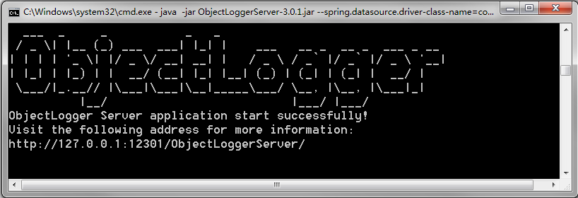
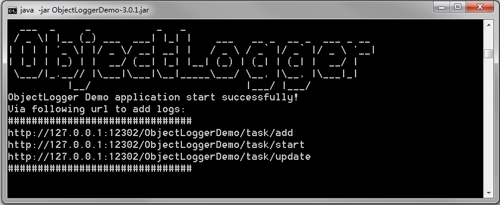

<div align="left">
  
</div>

# [ObjectLogger](https://github.com/yeecode/ObjectLogger)


[](https://codebeat.co/projects/github-com-yeecode-objectlogger-master)


强大且易用的Java对象日志记录系统，支持对象属性变化的自动分析、记录、查询。

---

[English Introduction](./README.md)

---

# 1 系统简介

ObjectLogger是一套强大且易用的对象日志记录系统。它能够将任意对象的变动日志记录下来，并支持查询。可以应用在用户操作日志记录、对象属性变更记录等诸多场景中。


该系统具有以下特点：

- 一站整合：系统支持日志的记录与查询，开发者只需再开发前端界面即可使用。
- 完全独立：与业务系统无耦合，可插拔使用，不影响主业务流程。
- 应用共享：系统可以同时供多个业务系统使用，互不影响。
- 简单易用：服务端直接jar包启动；业务系统有官方Maven插件支持。
- 自动解析：能自动解析对象的属性变化，并支持富文本的前后对比。
- 便于扩展：支持自定义对象变动说明、属性变动说明。支持更多对象属性类型的扩展。

整个项目包含四个部分：

- ObjectLoggerClient：能够集成到业务系统进行日志分析、发送jar包。可以从Maven官方仓库引入该jar包。该模块位于`client`子包下。
- ObjectLoggerServer：一个web服务，需要数据库的支持。它能够接收并保存ObjectLoggerClient发出的日志信息，支持日志的查询操作。该模块位于`server`子包下。
- react-object-logger：一个React前端组件，用于进行日志的前端展示。可以从npm官方仓库引入该组件。该子项目位于[react-object-logger](https://github.com/promise-coding/react-object-logger)。
- ObjectLoggerDemo：一个业务端集成ObjectLoggerClient的示例。该模块位于`demo`子包下。

# 2 快速上手

## 2.1 创建数据库

使用该项目的`/server/database/init_data_table.sql`文件初始化两个数据表。

## 2.2 启动Server

下载该项目下最新的Server服务jar包，地址为`/server/target/ObjectLoggerServer-*.jar`。

启动下载的jar包。

```
java -jar ObjectLoggerServer-*.jar --spring.datasource.driver-class-name={db_driver} --spring.datasource.url=jdbc:{db}://{db_address}/{db_name} --spring.datasource.username={db_username} --spring.datasource.password={db_password}
```

上述命令中的用户配置项说明如下：

- `db_driver`:你所用的数据库对应的驱动。如果使用MySql数据库则为`com.mysql.jdbc.Driver`;如果使用SqlServer数据库则为`com.microsoft.sqlserver.jdbc.SQLServerDriver`。
- `db`:数据库类型。如果使用MySql数据库则为`mysql`;如果使用SqlServer数据库则为`sqlserver`。
- `db_address`:数据库连接地址。如果数据库在本机则为`127.0.0.1`。
- `db_name`:数据库名，该数据库中需包含上一步初始化的两个数据表。
- `db_username`:数据库登录用户名。
- `db_password`:数据库登录密码。

启动jar成功后可以看到下面的界面：



使用浏览器访问下面的页面可以看到系统欢迎页面：

```
http://127.0.0.1:12301/ObjectLoggerServer/
```

访问上述地址可以看到下面的欢迎界面：


至此，ObjectLoggerServer系统已经搭建结束，可以接受业务系统的日志写入和查询操作。

# 3 业务系统接入

该部分讲解如何配置业务系统来将业务系统中的对象变化通过ObjectLoggerClient分析，然后记录到ObjectLoggerServer中。

这一部分的使用可以参照ObjectLoggerDemo项目，该项目给出了业务系统集成ObjectLoggerClient的详细示例。ObjectLoggerDemo的制品包可以从`/demo/target/ObjectLoggerDemo-*.jar`获得，无需其他配置直接运行`java -jar ObjectLoggerDemo-*.jar`便可以直接启动该项目。

可以直接根据启动页面的提示访问相关地址来体验：



## 3.1 引入依赖包

在pom中增加下面的依赖：

```
<dependency>
    <groupId>com.github.yeecode.objectlogger</groupId>
    <artifactId>ObjectLoggerClient</artifactId>
    <version>{最新版本}</version>
</dependency>
```

## 3.2 添加对ObjectLoggerClient中bean的自动注入

### 3.2.1 对于SpringBoot应用

在SpringBoot的启动类前添加`@ComponentScan`注解，并在`basePackages`中增加ObjectLoggerClient的包地址：`com.github.yeecode.objectlogger`，如：

```
@SpringBootApplication
@ComponentScan(basePackages={"{your_beans_root}","com.github.yeecode.objectlogger"})
public class MyBootAppApplication {
public static void main(String[] args) {
    // 省略其他代码
  }
}
```
### 3.2.2 对于Spring应用

在`applicationContext.xml`增加对ObjectLoggerClient包地址的扫描：

```
<context:component-scan base-package="com.github.yeecode.objectlogger">
</context:component-scan>
```

## 3.3 完成配置

在`application.properties`中增加:

```
yeecode.objectLogger.serverAddress=http://{ObjectLoggerServer_address}
yeecode.objectLogger.businessAppName={your_app_name}
yeecode.objectLogger.autoLogAttributes=true
```

- `ObjectLoggerServer_address`:属性指向上一步的ObjectLoggerServer的部署地址，例如：`127.0.0.1:12301`
- `your_app_name`:指当前业务系统的应用名。以便于区分日志来源，实现同时支持多个业务系统
- `yeecode.objectLogger.autoLogAttributes`:是否对对象的所有属性进行变更日志记录

至此，业务系统的配置完成。已经实现了和ObjectLoggerServer端的对接。

# 4 日志查询

系统运行后，可以通过`http://127.0.0.1:12301/ObjectLoggerServer/log/query`查询系统中记录的日志，并通过传入参数对日志进行过滤。


通过这里，我们可以查询下一步中写入的日志。

# 5 日志展示

ObjectLogger有前端React组件[react-object-logger](https://github.com/promise-coding/react-object-logger)支持，用于进行日志信息的展示。体验页面：[react-object-logger 示例页面](https://promise-coding.github.io/react-object-logger/)

展示效果如图：


感兴趣的用户可以前往[react-object-logger](https://github.com/promise-coding/react-object-logger)进行了解。

同时也欢迎各位开发者开发面向其它前端技术栈的组件。

# 6 日志写入

业务系统在任何需要进行日志记录的类中引入`LogClient`。例如：

```
@Autowired
private LogClient logClient;
```

## 6.1 简单使用

直接将对象的零个、一个、多个属性变化放入`List<BaseAttributeModel>`后调用`logAttributes`方法发出即可。`List<BaseAttributeModel>`置为`null`则表示此次对象无需要记录的属性变动。例如，业务应用中调用：

```
logClient.logAttributes(
                "CleanRoomTask",
                5,
                "Tom",
                "add",
                "Add New Task",
                "Create a cleanRoomTask",
                "taskName is :Demo Task",
                null);
```

在ObjectLoggerServer中使用如下查询条件：
```
http://127.0.0.1:12301/ObjectLoggerServer/log/query?appName=ObjectLoggerDemo&objectName=CleanRoomTask&objectId=5
```

查询到日志：
```
{
  "respMsg": "SUCCESS",
  "respData": [
    {
      "id": 1,
      "appName": "ObjectLoggerDemo",
      "objectName": "CleanRoomTask",
      "objectId": 5,
      "operator": "Jone",
      "operationName": "start",
      "operationAlias": "Start a Task",
      "extraWords": "Begin to clean room...",
      "comment": "Come on and start cleaning up.",
      "operationTime": "2019-07-04T06:53:40.000+0000",
      "attributeModelList": [
        {
          "attributeType": "NORMAL",
          "attributeName": "status",
          "attributeAlias": "Status",
          "oldValue": "TODO",
          "newValue": "DOING",
          "diffValue": null,
          "id": 1,
          "operationId": 1
        }
      ]
    }
  ],
  "respCode": "1000"
}
```

## 6.2 对象变动自动记录

该功能可以自动完成新老对象的对比，并根据对比结果，将多个属性变动一起写入日志系统中。使用时，要确保传入的新老对象属于同一个类。

例如，业务系统这样调用：

```
CleanRoomTask oldTask = new CleanRoomTask();
oldTask.setId(5);
oldTask.setTaskName("Demo Task");
oldTask.setStatus("TODO");
oldTask.setDescription("Do something...");

CleanRoomTask newTask = new CleanRoomTask();
newTask.setId(5);
newTask.setTaskName("Demo Task");
newTask.setStatus("DOING");
newTask.setDescription("The main job is to clean the floor.");
newTask.setAddress("Sunny Street");
newTask.setRoomNumber(702);

logClient.logObject(
                cleanRoomTask.getId().toString(),
                "Tom",
                "update",
                "Update a Task",
                null,
                null,
                oldTask,
                newTask);
```

则我们可以使用下面查询条件：

```
http://127.0.0.1:12301/ObjectLoggerServer/log/query?appName=ObjectLoggerDemo&objectName=CleanRoomTask&objectId=5
```

查询到如下结果：

```
{
  "respMsg": "SUCCESS",
  "respData": [
    {
      "id": 4,
      "appName": "ObjectLoggerDemo",
      "objectName": "CleanRoomTask",
      "objectId": 5,
      "operator": "Tom",
      "operationName": "update",
      "operationAlias": "Update a Task",
      "extraWords": null,
      "comment": null,
      "operationTime": "2019-07-04T07:22:59.000+0000",
      "attributeModelList": [
        {
          "attributeType": "NORMAL",
          "attributeName": "roomNumber",
          "attributeAlias": "roomNumber",
          "oldValue": "",
          "newValue": "702",
          "diffValue": null,
          "id": 5,
          "operationId": 4
        },
        {
          "attributeType": "NORMAL",
          "attributeName": "address",
          "attributeAlias": "address",
          "oldValue": "",
          "newValue": "Sunny Street",
          "diffValue": null,
          "id": 6,
          "operationId": 4
        },
        {
          "attributeType": "NORMAL",
          "attributeName": "status",
          "attributeAlias": "Status",
          "oldValue": "TODO",
          "newValue": "DOING",
          "diffValue": null,
          "id": 7,
          "operationId": 4
        },
        {
          "attributeType": "TEXT",
          "attributeName": "description",
          "attributeAlias": "Description",
          "oldValue": "Do something...",
          "newValue": "The main job is to clean the floor.",
          "diffValue": "Line 1<br/>&nbsp;&nbsp;&nbsp; -： <del> Do something... </del> <br/>&nbsp;&nbsp; +： <u> The main job is to clean the floor. </u> <br/>",
          "id": 8,
          "operationId": 4
        }
      ]
    }
  ],
  "respCode": "1000"
}
```

# 7 对象属性过滤

有些对象的属性的变动不需要进行日志记录，例如`updateTime`、`hashCode`等。ObjectLoggerClient支持对对象的属性进行过滤，只追踪我们感兴趣的属性。

并且，对于每个属性我们可以更改其记录到ObjectLoggerClient系统中的具体方式，例如修改命名等。

要想启用这个功能，首先将配置中的`yeecode.objectLogger.autoLogAttributes`改为`false`。

```
yeecode.objectLogger.autoLogAttributes=true
```

然后在需要进行变化日志记录的属性上增加`@LogTag`注解。凡是没有增加该注解的属性在日志记录时会被自动跳过。

例如，注解配置如下则`id`字段的变动将被忽略。

```
private Integer id;

@LogTag
private String taskName;

@LogTag(alias = "UserId", extendedType = "userIdType")
private int userId;

@LogTag(alias = "Status")
private String status;

@LogTag(alias = "Description", builtinType = BuiltinTypeHandler.TEXT)
private String description;
```

该注解属性介绍如下：

- alias:属性别名。默认情况下会将属性名写入。
- builtinType：ObjectLoggerClient的内置类型，为BuiltinTypeHandler的值。默认为`BuiltinTypeHandler.NORMAL`。
    - BuiltinTypeHandler.NORMAL：记录属性的新值和旧值，对比值为null
    - BuiltinTypeHandler.RICHTEXT: 用户富文本对比。记录属性值的新值和旧值，并将新旧值转化为纯文本后逐行对比差异，对比值中记录差异
- extendedType：扩展属性类型。使用ObjcetLogger时，用户可以扩展某些字段的处理方式，此时，`alias`等信息均可以被用户自主覆盖。

# 8 属性处理扩展

很多情况下，用户希望能够自主决定某些对象属性的处理方式。例如，对于例子中`Task`对象的`userId`属性，用户可能想将其转化为姓名后存入日志系统，从而使得日志系统与`userId`完全解耦。

ObjectLoggerClient完全支持这种情况，可以让用户自主决定某些属性的日志记录方式。要想实现这种功能，首先在需要进行扩展处理的属性上为`@LogTag`的`extendedType`属性赋予一个字符串值。例如：

```
@LogTag(alias = "UserId", extendedType = "userIdType")
private int userId;
```

然后在业务系统中声明一个Bean继承BaseExtendedTypeHandler，作为自由扩展的钩子。代码如下:

```
@Service
public class ExtendedTypeHandler implements BaseExtendedTypeHandler {
    @Override
    public BaseAttributeModel handleAttributeChange(String extendedType, String attributeName, String attributeAlias, Object oldValue, Object newValue) {
        // TODO
    }
}
```

接下来，当ObjectLoggerClient处理到该属性时，会将该属性的相关信息传入到扩展Bean的`handleAttributeChange`方法中，然后用户可以自行处理。传入的四个参数解释如下：

- `extendedType`：扩展类型值，即`@LogTag`注解的`extendedType`值。本示例中为`userIdType`。
- `attributeName`：属性名。本示例中为`userId`。
- `attributeAlias`：属性别名，`@LogTag`注解的`alias`值。本示例中为`UserId`。
- `oldValue`：该属性的旧值。
- `newValue`：该属性的新值。

例如我们可以采用如下的方式处理`userIdType`属性：

```
@Service
public class ExtendedTypeHandler implements BaseExtendedTypeHandler {
    @Override
    public BaseAttributeModel handleAttributeChange(String extendedType, String attributeName, String attributeAlias, Object oldValue, Object newValue) {
        BaseAttributeModel baseAttributeModel = new BaseAttributeModel();
        if (extendedType.equals("userIdType")) {
            baseAttributeModel.setOldValue("USER_" + oldValue);
            baseAttributeModel.setNewValue("USER_" + newValue);
            baseAttributeModel.setDiffValue(oldValue + "->" + newValue);
        }
        return baseAttributeModel;
    }
}
```

## 9 Roadmap

- TODO：增加对象深度镜像功能
- 3.0.1: 优化系统命名，对比值输出转为灵活的json
- 3.0.0：优化系统命名
- 2.3.0：增加对继承属性的自动记录功能
- 2.2.0：增加全局对象属性变动自动记录功能
- 2.0.1：日志写入支持多线程
- 2.0.0：重新组织代码结构
- 1.0.0：实现基本功能