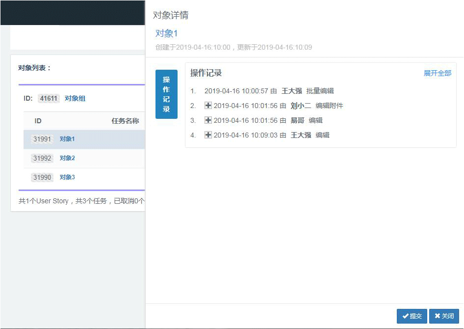

<div align="left">

</div>

# ObjectLogger


[](https://codebeat.co/projects/github-com-yeecode-objectlogger-master)


高效易用的Java对象日志记录系统，支持对象属性变动的记录与查询。

---

[English Introduction](./README.md)

---

# 1 系统应用

众多系统的运行中需要对各个对象的日志进行记录，这些日志内容包括但不限于：

- 对象零个、一个或者多个属性的变化
- 用户针对对象的操作
- 其他对象状态的转变

这些操作日志被记录下来后，还需要提供相应的查询接口。

该开源项目的目的便在于协助开发者完成对象日志的采集、存储、查询操作。

使用该项目记录后，能达到如下图所示效果：



# 2 系统特点

- 功能强大：部署完成后，可以支持日志的记录与查询，开发者只需再开发前端界面即可使用。
- 完全独立：该系统与业务系统完全独立，可插拔使用，不影响主业务流程。并且可以同时支持多个业务系统使用。
- 简单易用：系统采用SpringBoot实现，可以独立jar包启动。同时向业务系统提供jar包，便于日志的分析与写入。
- 自动解析：能自动解析被操作对象的零个、一个、多个属性变动，支持富文本对象的前后对比。
- 便于扩展：支持自定义对象变动说明、属性变动说明。支持更多对象属性类型的扩展

# 3 系统部署

## 3.1 数据库部分部署

自备数据库。使用该项目的`/server/database/init_data_table.sql`文件初始化两个数据表。

## 3.2 ObjectLogger系统部署

1. 下载该git项目代码。
2. 根据你的数据库种类、地址、密码等配置`/server/src/main/resources/application.properties`文件中的下面部分：
```
spring.datasource.driver-class-name ={db_driver}
spring.datasource.url =jdbc:mysql://{your_mysql_address}/{your_database_name}
spring.datasource.username ={your_database_username}
spring.datasource.password ={your_database_password}
```
3. 使用maven打包该项目的jar包。
4. 获取`target`目录下的jar包，使用`java -jar ObjectLogger-1.0.1.jar`启动项目。项目默认端口`8080`。

至此，已经可以可以通过对应接口访问该系统,如图：


## 3.3 业务系统配置

该部分主要讲解如何配置业务系统来实现将业务系统中的对象变化记录到ObjectLogger中。

### 3.3.1 业务系统添加maven依赖

```
<dependency>
    <groupId>com.github.yeecode.objectLogger</groupId>
    <artifactId>ObjectLoggerClient</artifactId>
    <version>1.0.4</version>
</dependency>
```

### 3.3.2 添加对ObjectLoggerClient中提供的bean的扫描注入。

若业务应用为SpringBoot应用，则在SpringBoot的启动类前添加`@ComponentScan`注解，并在`basePackages`中增加ObjectLoggerClient的包地址：`com.github.yeecode.objectLoggerClient`，如：
```
@SpringBootApplication
@ComponentScan(basePackages={"{your_beans_root}","com.github.yeecode.objectLoggerClient"})
public class MyBootAppApplication {

public static void main(String[] args) {
    SpringApplication.run(MyBootAppApplication.class, args);
}
}
```

若业务应用为Spring应用，则在`applicationContext.xml`增加对ObjectLoggerClient包地址的扫描：
```
<context:component-scan base-package="com.github.yeecode.objectLoggerClient">
</context:component-scan>
```

### 3.3.3 添加对ObjectLoggerClient的配置

在`application.properties`中增加:

```
object.logger.add.log.api=http://{your_ObjectLogger_address}/ObjectLogger/log/add
object.logger.appName={your_app_name}
```

- `object.logger.add.log.api`属性指向上一步的ObjectLogger的部署地址，用于将业务系统的日志发送到那里。
- `object.logger.appName`指明了当前业务系统的应用名以便于区分日志来源，实现同时支持多个业务系统

### 3.3.4 声明一个扩展LocalTypeHandler的类，作为自由扩展的钩子

```
@Service
public class LocalTypeHandlerBean implements LocalTypeHandler {

    @Override
    public ActionItemModel handleLocalType(String subLocalType, String oldValue, String newValue) {
        return null;
    }
}
```

至此，整个系统部署结束。

# 4 系统使用

系统运行后，可以通过`/ObjectLogger/log/query`查询系统中记录的log，并通过传入参数对log进行过滤。


首先，业务系统在任何需要进行日志记录的类中引入`LogClient`。例如：
```
@Autowired
private LogClient logClient;
```

## 4.1 简单使用

直接将对象的零个、一个、多个属性变化放入`actionItemModelList`中发出即可。`actionItemModelList`置为`null`则表示此次对象无需要记录的属性变动。例如，业务应用中调用：
```
logClient.sendLogForItems("TaskModel",5,"actor name","addTask","add Task","via web page","some comments",null);
```

在ObjectLogger中使用如下查询条件：
```
http://{your_ObjectLogger_address}/ObjectLogger/log/query?appName=myBootApp&objectName=TaskModel&objectId=5
```

查询到日志：
```
{
  "respMsg": "成功",
  "respData": [
    {
      "id": 16,
      "appName": "myBootApp",
      "objectName": "TaskModel",
      "objectId": 5,
      "actor": "actor name",
      "action": "addTask",
      "actionName": "add Task",
      "extraWords": "via web page",
      "comment": "some comments",
      "actionTime": "2019-04-10T10:56:15.000+0000",
      "actionItemModelList": []
    }
  ],
  "respCode": "1000"
}
```

## 4.2 对象变动自动记录

该功能可以自动完成新老对象的对比，并根据对比结果，将多个属性变动一起写入日志系统中。使用时，要确保传入的新老对象属于同一个类。

例如，业务系统这样调用：

```
TaskModel oldTaskModel = new TaskModel();
oldTaskModel.setId(9);
oldTaskModel.setTaskName("oldName");
oldTaskModel.setUserId(3);
oldTaskModel.setDescription("\t<p>the first line</p>\n" +
        "\t<p>the second line</p>\n" +
        "\t<p>the 3th line</p>");

TaskModel newTaskModel = new TaskModel();
newTaskModel.setId(9);
newTaskModel.setTaskName("newName");
newTaskModel.setUserId(5);
newTaskModel.setDescription("\t<p>the first line</p>\n" +
        "\t<p>the second line</p>\n" +
        "\t<p>the last line</p>");

logClient.sendLogForObject(9,"actor name","editTask","edit Task","via app",
"some comments",oldTaskModel,newTaskModel);
```

则我们可以使用下面查询条件：

```
http://{your_ObjectLogger_address}/ObjectLogger/log/query?appName=myBootApp&objectName=TaskModel&objectId=9
```

查询到如下结果：

```
{
  "respMsg": "成功",
  "respData": [
    {
      "id": 15,
      "appName": "myBootApp",
      "objectName": "TaskModel",
      "objectId": 9,
      "actor": "actor name",
      "action": "editTask",
      "actionName": "edit Task",
      "extraWords": "via app",
      "comment": "some comments",
      "actionTime": "2019-04-10T10:56:17.000+0000",
      "actionItemModelList": [
        {
          "id": 18,
          "actionId": 15,
          "attributeType": "NORMAL",
          "attribute": "taskName",
          "attributeName": "TASK",
          "oldValue": "oldName",
          "newValue": "newName",
          "diffValue": null
        },
        {
          "id": 19,
          "actionId": 15,
          "attributeType": "USERID",
          "attribute": "userId",
          "attributeName": "USER",
          "oldValue": "USER:3",
          "newValue": "USER:5",
          "diffValue": "diffValue"
        },
        {
          "id": 20,
          "actionId": 15,
          "attributeType": "TEXT",
          "attribute": "description",
          "attributeName": "DESCRIPTION",
          "oldValue": "\"\\t<p>the first line</p>\\n\\t<p>the second line</p>\\n\\t<p>the 3th line</p>\"",
          "newValue": "\"\\t<p>the first line</p>\\n\\t<p>the second line</p>\\n\\t<p>the last line</p>\"",
          "diffValue": "第6行变化:<br/>&nbsp;&nbsp;&nbsp; -： <del> the 3th line </del> <br/>&nbsp;&nbsp; +： <u> the last line </u> <br/>"
        }
      ]
    }
  ],
  "respCode": "1000"
}
```

对象属性的自动对比需要`@LogDescription`注解的支持。对于对象中未加注解的属性会自动跳过对比。

例如，本次示例中的注解配置如下：

```
@LogDescription(name = "TASK")
private String taskName;

@LogDescription(name = "USER",type = AttributeTypeEnum.LOCALTYPE,localType = LocalTypeHandlerBean.USERID)
private Integer userId;

@LogDescription(name = "DESCRIPTION",type = AttributeTypeEnum.TEXT)
private String description;
```

该注解属性介绍如下：

- name:必填，对应写入日志后的`attributeName`值。
- type：为AttributeTypeEnum的值，默认为`AttributeTypeEnum.NORMAL`。
    - AttributeTypeEnum.NORMAL：记录属性的新值和旧值，对比值为null
    - AttributeTypeEnum.TEXT: 用户富文本对比。记录属性值的新值和旧值，并将新旧值转化为纯文本后逐行对比差异，对比值中记录差异
    - AttributeTypeEnum.LOCALTYPE：表明该字段由用户自定义处理，此时localType生效。
- localType：当`type = AttributeTypeEnum.LOCALTYPE`时生效。此时，该字段如果新旧值不一样，则会传递到LocalTypeHandler的实现类中。例如，示例中`userId`字段交由实现类处理，代码如下：

```
@Service
public class LocalTypeHandlerBean implements LocalTypeHandler {

    public static final String USERID = "USERID";

    @Override
    public ActionItemModel handleLocalType(String subLocalType, String oldValue, String newValue) {
        ActionItemModel logActionItemModel = new ActionItemModel();

        if (subLocalType.equals(USERID)) {
            logActionItemModel.setNewValue("USER:" + newValue);
            logActionItemModel.setOldValue("USER:" + oldValue);
            logActionItemModel.setDiffValue("diffValue");
        } else {
            logActionItemModel = null;
        }
        return logActionItemModel;
    }
}
```
